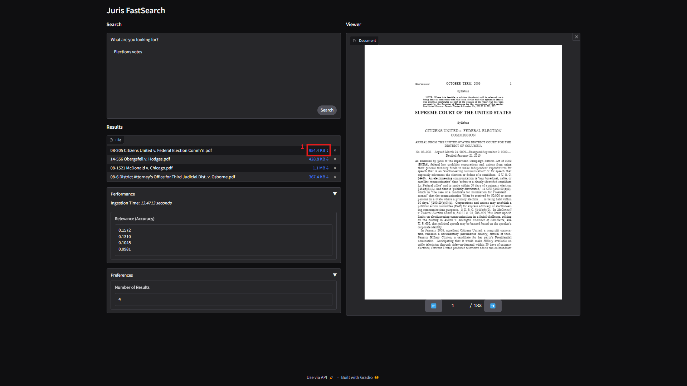

# Examples

For example, you want to search for "Election votes".

1. Click on the search box, type "Elections votes"
2. Click on **Search** at the bottom right on the search box

> [!TIP]
> You can click [Shift] + [Enter] to search without needing your hands to leave the keyboard

## View document

For example, you have searched "Election votes" and wants to look at the document of the second result.

1. Under the _Results_ section, click on _14-556 Obergefell v. Hodges.pdf_ (2nd result)
2. Observe the the document viewer has updated to show the new document

## Download document

You want to download the document _08-205 Citizens United v. Federal Election Comm'n.pdf_.

1. Under the _Results_ section, beside _08-205 Citizens United v. Federal Election Comm'n.pdf_, click on "954.4 KB ⇣"

## Change number of results to display

For example, you want the search to display four results.

1. Expand the _Preferences_ section
2. Click on the textbox for "Number of Results" and change to "4"

