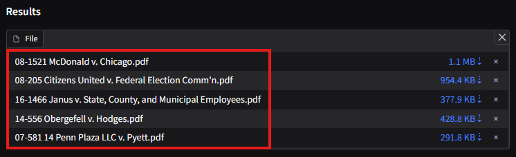
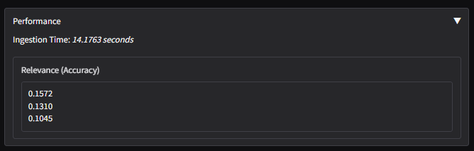

# Features

## Document-backed Results

Each result is a reference file that we found to be relavent to you. The results are ordered with the highest relevance at the top.

> Red box indicates the list of documents found to be relevant

## Easy Download

You can easily download the reference document by clicking the download link provided along with the file names.

The file size is also shown for the user's information and decision on whether to download the document.

> Red box indicates the file size of each document, and can be clicked to download

## Build-in Viewer

You can also quickly glance at the contents of the files to determine that is it useful for you before choose to download the files.

Simply click on the file name and the build-in viewer will display the file.
At the bottom of the viewer, you can click :arrow_left: and :arrow_right: to move flip the pages of the document.
Additionally, you can click on the current page number at the bottom and type in the page number to go to.

## Performance

You can better understand how to application is doing by looking at its performance.

This section is opened by default, and can be hidden by the user if deemed not useful.

## Preferences

There are also some preferences you can set.

This section is closed by default, and can be opened to modify the preferences.

